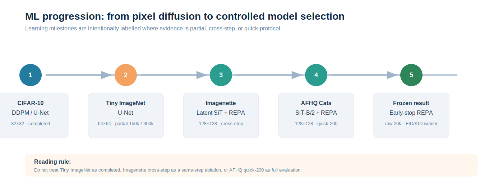
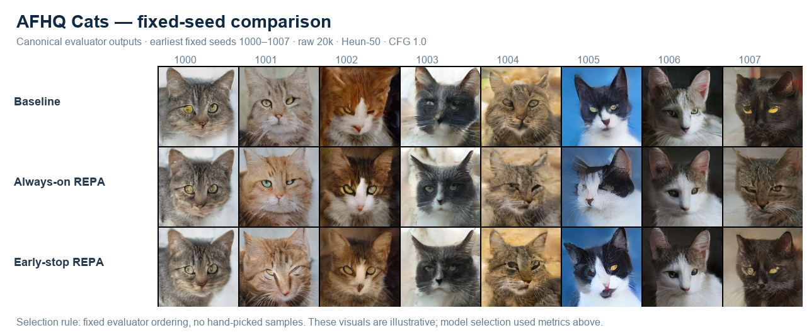
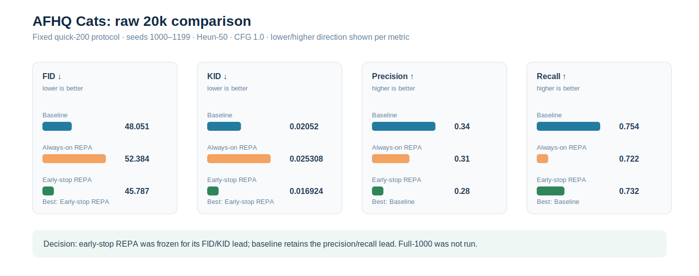
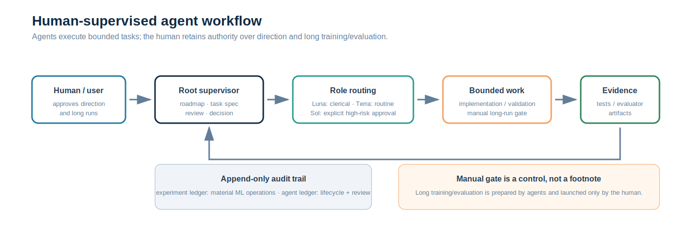

# Human-in-the-Loop Generative ML Lab

## The problem

This began as an applied-ML learning project: build a diffusion model rather than only read about one, then make each model decision inspectable. It became a second engineering question as the work grew: can bounded agents improve the research workflow without obscuring who decided what?

The answer is a local, human-supervised lab workflow—not a production MLOps service. The human set direction, approved experiment scope, made continue/stop/freeze decisions, and manually launched long runs. Agents handled bounded tasks with defined files, commands, stop conditions, and an audit record. The model and the workflow are one case: better process discipline made it easier to compare models honestly.

## What I personally owned

My role was not simply to prompt agents and accept their output. I chose the learning sequence, decided which questions were worth GPU time, approved the comparison protocols, manually launched the long runs, and made the final model-selection calls. When evidence was incomplete, I chose whether to continue, stop, or retain the result only as a partial milestone.

The agents were an execution layer around those decisions. They investigated bounded problems, implemented approved changes, ran scoped checks, extracted evidence, and kept documentation and ledgers consistent. The supervisor/worker structure helped me separate “the command completed” from “the evidence is strong enough to make a decision.” That distinction became especially important once several checkpoints, weight variants, samplers, and evaluation protocols existed at the same time.

## ML outcomes

The project moved through four deliberate stages:

1. A class-conditioned CIFAR-10 DDPM/U-Net established the full training, sampling, checkpoint/resume, and failure-diagnosis loop. The completed 200k-step baseline later supported a fixed local performance benchmark: 2,272.92 images/s after optimisation versus 1,787.57 historically (+27.15%). [Report](../reports/cifar10_optimization_report.md)
2. Tiny ImageNet was treated as a partial learning milestone, not polished into a result: work stopped at 150k of a planned 400k steps. [Report](../reports/tiny_imagenet_partial.md)
3. Latent SiT-S/2 on Imagenette provided a controlled baseline-to-REPA comparison. Under a fixed 1,000-sample EMA Heun-50 protocol, REPA at 350k outperformed the 100k baseline on FID (130.96 vs 149.95), KID (0.05199 vs 0.06103), accuracy (29.5% vs 26.9%), and recall (72.1% vs 51.0%), while precision was slightly lower (23.9% vs 24.6%). It is a **cross-step** result; it does not prove faster convergence or a same-step win. [Evaluator report](../reports/imagenette_sit_evaluator_setup.md)
4. AFHQ Cats SiT-B/2 made the trade-off concrete. In the held-out, fixed quick-200 comparison (seeds 1000–1199, Heun-50, CFG 1.0), early-stop REPA raw 20k had the best FID/KID: 45.787/0.01692, versus baseline 48.051/0.02052 and always-on REPA 52.384/0.02531. [Result report](../reports/afhq_cat_sit_b_128_repa_early_stop_results.md)

The AFHQ decision is intentionally narrow. The baseline still has higher precision (0.340 vs 0.280) and recall (0.754 vs 0.732); full-1000 was deliberately skipped; the repeated quick run used the same seeds and is not an independent replicate. The selected checkpoint is therefore the winner for this bounded decision, not an overall or statistically significant best model.

Several stops matter as much as the successful runs. The black/white CIFAR samples triggered a sampler investigation rather than being hidden behind a better-looking grid. Tiny ImageNet was stopped part-way through instead of consuming more compute without a sufficiently valuable next question. On AFHQ, always-on REPA was removed from finalist consideration because the unified comparison did not support it, even though REPA had looked useful in the earlier Imagenette stage. These choices show the core practice: a learning project still needs explicit criteria for when evidence justifies more work.

## Why the evaluation process matters

Visual grids are necessary but insufficient for model selection. The evaluator locks the seed set, sampler, CFG, VAE, held-out reference split, and feature extractor, then records FID, KID, precision, recall, finite/black-white/low-detail failures, duplicates, and nearest-neighbour checks. Checkpoint hashes are inspected before and after evaluation; fixed-seed probes were deterministic. [Protocol evidence](../reports/afhq_cat_sit_b_128_repa_early_stop_results.md)

That discipline drove a useful decision: always-on REPA was excluded, while the early-stop variant was frozen with its precision/recall caveat attached.

The metric trade-off also changed how I describe the outcome. FID and KID supported selecting early-stop for this stage, but precision and recall prevented a simplistic “better model” headline. The fixed-seed grid provides a readable visual counterpart, while the report preserves protocol and diagnostic detail. Neither is treated as sufficient alone.

## Agent pipeline: control before autonomy

The workflow has explicit ownership:

- **Human:** sets learning and portfolio goals, approves scope, decides whether to continue, stop, change, or freeze, and manually launches long training/evaluation.
- **Supervisor:** reads evidence, writes a bounded task specification, reviews the worker’s report, and records the final decision.
- **Workers:** perform only approved investigation, implementation, validation, and documentation; each task appends a start and terminal event.

Luna is reserved for deterministic clerical tasks, Terra for routine implementation/validation, and Sol for explicitly approved complex work. ML-operation and agent-execution ledgers are separate and append-only. [Reference policy](agent_orchestration.md)

This was designed to preserve reviewability: agents did not independently choose experiments or autonomously run long GPU jobs.

The human gate is practical, not ceremonial. Long runs can consume hours of GPU time, create a new checkpoint lineage, or make later comparisons ambiguous if launched with the wrong configuration. Before such a run, the intended parent checkpoint, output directory, stop limit, and acceptance evidence must be clear. Afterward, artifact inspection and evaluation remain separate steps, and the supervisor—not the worker that ran a command—makes the final continue/stop/change/freeze decision.

The two-ledger design is equally deliberate. The experiment ledger answers what materially happened to the ML project: command, configuration, hashes, metrics, and resulting decision. The agent ledger answers who executed a bounded task, under which constraints, and whether a supervisor later accepted it. Keeping them separate prevents agent activity from being mistaken for experimental evidence or human approval.

## Operational observation, not a result

After preliminary routing/orchestration setup, the account usage view appeared to show roughly **5× lower** token consumption. This is an anecdotal, directional observation only: there is no instrumented before/after benchmark, causal analysis, or per-agent telemetry. The next step is to collect raw input/output/reasoning/cached-token counters, model/profile, task IDs, and matched workload windows before making any efficiency claim. [Evidence boundary](../reports/portfolio_claim_evidence_matrix.md)

## Impact and next steps

The project demonstrates a complete applied loop: implement a model, diagnose failure, define a fair comparison, preserve evidence, accept a trade-off instead of hiding it, and use controlled assistance to keep the loop auditable. Its strongest outcome is not one metric in isolation; it is the ability to explain why a model was selected, what evidence supports that choice, what evidence limits it, and who made the decision.

The current ML stage is frozen while portfolio packaging is completed. The next planned research step is a separately scoped Cats-to-all-AFHQ transfer experiment using the frozen early-stop checkpoint as a parent artifact; it is not started by this documentation. For evidence navigation and practical constraints, see the [README](../README.md), [technical retrospective](technical_retrospective.md), and [reproducibility guide](reproducibility.md).
